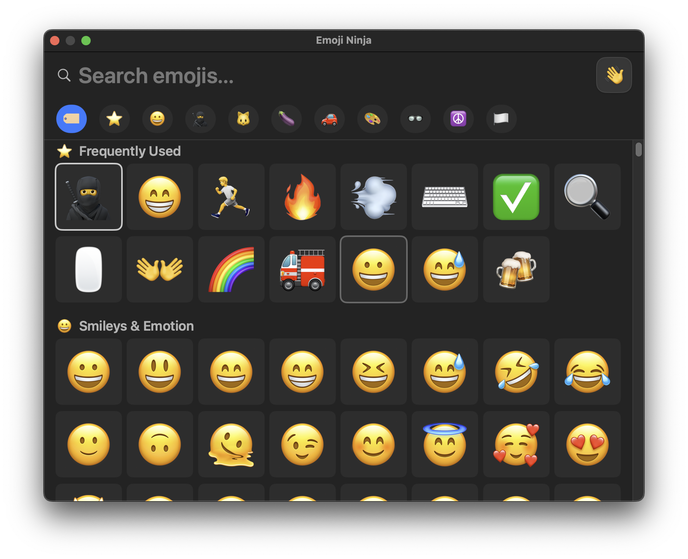

# Emoji Ninja 🥷
[](https://github.com/mikkelam/Emoji-Ninja/actions/workflows/ci.yml)

Become the emoji master in any chat 🤙

A performant macOS emoji picker. No fuss, just find emojis. Fast.



## Features

- **Fast Search**: Find your favorite emoji with ease 🔍️
- **Keyboard Navigation**: Arrow keys + Enter for selection ⌨️
- **Smart Pop**: The window pops next to your cursor if you prefer to use your mouse 🖱️
- **Skin Tone Support**: Choose from different skin tones 🌈
- **Global Hotkey**: Quick access with `⌘⌃Space` 🔥🔑
- **100% Offline**

Free and open source. Forever.

## Downloads
Pre-built application bundles can be downloaded from [GitHub Releases](https://github.com/mikkelam/emoji-ninja/releases/).

**Installation:** Since the app is unsigned (keeping it free!), macOS will show a security warning on first launch.

**To install:**
1. Download and extract the app to Applications
2. **Right-click** the app and select **"Open"**
3. Click **"Open"** in the security dialog
4. The app will now launch normally in the future

This is the standard process for many free Mac apps and only needs to be done once.

**Troubleshooting:** If you get a "damaged and can't be opened" error instead, try either:

**Option 1 - System Settings:**
Go to System Settings → Privacy & Security → scroll down to find "Emoji Ninja" and click "Open Anyway"

**Option 2 - Terminal command:**
```bash
xattr -d com.apple.quarantine "/Applications/Emoji Ninja.app"
```

Both methods remove the quarantine flag that triggers the stronger security block. The app isn't actually damaged - this is just macOS being extra cautious with unsigned apps. This is needed because I don't pay the Apple developer tax.

### Build from Source

**Requirements:**
- macOS 14.0+
- Swift 6.0+
- [just](https://github.com/casey/just) command runner: `brew install just`

**Install to /Applications:**
```bash
just install
```

## Development

This project is Xcode-free! All builds use Swift Package Manager via `just` commands.

**Essential commands:**
- `just dev` - Build debug version and run (shows console output for debugging)
- `just run` - Build and run debug version
- `just install` - Build release version and install to /Applications
- `just clean` - Clean build artifacts
- `just -l` - Show all available commands

## License

MIT License
